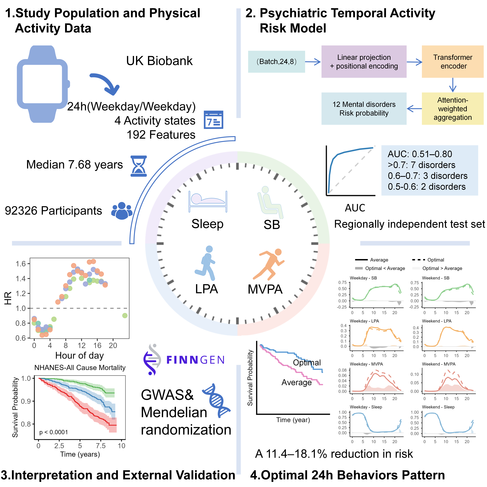

# Temporal Behavioral Patterns of the 24-Hour Activity Cycle Across Mental Disorders


This repository provides the analysis pipeline supporting the study:

**Shared and Distinct Temporal Behavioral Risk Patterns in Mental Disorders: A Transformer-Based Analysis of 24-Hour Activity Cycles**

The project develops and applies the **Psychiatric Temporal Activity Risk Model (PTARM)**, a Transformer-based framework that decodes high-resolution temporal patterns of daily behavior derived from wearable accelerometers and links these behavioral clocks to the risk of 12 mental disorders. The pipeline further integrates multi-omics mediation analysis and Mendelian randomization to characterize biological pathways and causal effects, and derives population-level optimal 24-hour activity cycle (24-HAC) patterns through a contrastive optimization framework for individualized behavioral recommendation.

```



```

---
# Project Overview

This project characterizes how 24-hour activity patterns relate to the risk of multiple mental disorders.

The pipeline enables:

- PTARM — predicts the risk of 12 mental disorders from hourly accelerometer features
- Mediation analysis — identifies multi-omics mediators linking behavior to disease
- Mendelian randomization — evaluates causal effects of behaviors on disease risk
- Behavioral recommendation — derives optimal 24-hour activity patterns that minimize multi-disorder risk

All analyses are designed for population-level inference and hypothesis generation, rather than individualized clinical decision-making.

---
# Project Structure

```
Mental-disorder/
├── Mediation analysis/ 
│   ├── Pro_mediation.R   
│   └── inflame_metab_mediation.R 
│    
├── Mendelian randomization/
│   └── MR.R 
│ 
├── PTARM/                      
│   ├── Pcalibration.py                         
│   ├── model.py
│   ├── requirements.txt              
│   └── test.py   
│
├── behavioral recommendation/  
│   └── activity recommendation.R  
│               
└── README.md
```

---
# Core Components

## 1 .Psychiatric Temporal Activity Risk Model (PTARM)

**Location:** `PTARM/`

PTARM is a deep-learning architecture combining a Transformer encoder with attention-based pooling to model high-resolution 24-hour behavioral time series for mental disorder risk prediction.

**Key characteristics:**

- **Input**: 192-dimensional behavioral matrix
    - 2 day types (weekday / weekend) × 24 hours × 4 behavioral states
- **Behavioral states:**
    - Sedentary behavior (SB)
    - Light physical activity (LPA)
    - Moderate-to-vigorous physical activity (MVPA)
    - Sleep
- Uses only non-invasive wearable-derived behavioral features

**Outputs:**

- Disorder-specific  risk probabilities

---
## 2. Mediation Analysis

**Location:** `Mediation analysis/`

Structural equation modeling (SEM) is used to evaluate whether molecular biomarkers statistically mediate associations between behaviors and disease risk.

**Outputs:**

- Direct and indirect (mediated) effects of behaviors on disorders

---
## 3. Mendelian Randomization

**Location:** `Mendelian randomization/`

Two-sample Mendelian randomization was performed to assess the causal effects of behaviors on mental disorders.

**Methods implemented:**

- Inverse-variance weighted (IVW)
- Weighted median
- MR-Egger

**Additional analyses:**

- Sensitivity analyses for horizontal pleiotropy
- Heterogeneity testing

---
## 4. Behavioral Recommendation

**Location:** `behavioral recommendation/`

This module derives population-level optimal 24-hour activity patterns through contrastive optimization based on PTARM-predicted risk.

**Key features:**

- Time-aware reallocation of behavioral states across the 24-hour cycle
- Physiologically realistic constraints (fixed day length, feasible state transitions)

	**Important note:** All estimated risk reductions reflect simulated, population-level potential, not empirically observed intervention effects.

---
# Installation

## Python Environment

```
pip install -r requirements.txt
```

---
# Data Requirements

This repository does **not** include individual-level UK Biobank or NHANES data.

Expected inputs include:

- Wearable-derived behavioral features (hourly resolution)
- Disease outcome tables (ICD-coded incident events)
- Proteomic and metabolomic measurements
- GWAS summary statistics for Mendelian randomization

Users must obtain and preprocess data in accordance with the access policies of the relevant cohorts.

---
# Validation and Scope

- PTARM performance was evaluated across 12 mental disorders
- Generalizability was supported by population-level analyses using NHANES mortality data
- External datasets were used to support robustness and biological  interpretation, not as strict clinical validation
---
# Web Resource

An interactive, open-access platform for exploring the temporal architecture of 24-hour activity behaviors across mental disorders is available at:

**[http://nerve.zBiolab.cn](http://nerve.zBiolab.cn)**

---
# Disclaimer

This repository provides research code for **population-level behavioral epidemiology**. All findings should be interpreted in the context of observational data. Prospective trials are required before any clinical or public health implementation.

